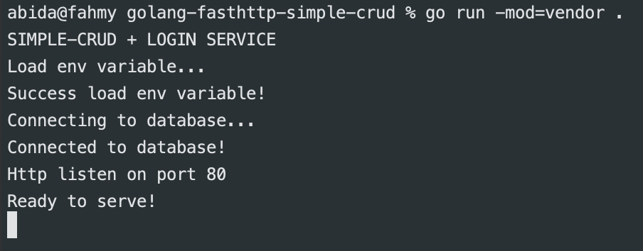

# CRUD with GOLANG

#### how to use ?
- clone repo
- run --> "go run -mod=vendor ."

or wanna build ?
- "go build -mod=vendor ."
---

go version 1.16

framework fasthttp

database postgress, ddl are available in this repo

log are available in file format, path for log are here --> "./log"

---
list API
1. POST /login  *use header basic Auth
2. GET /users?limit=?&offset=?
3. GET /user/{:id}
4. POST /user
5. PUT /user/{:id}
6. DELETE /user/{:id}

*postman collection are available on this repo

NOTE 
password is hashing used HMAC-SHA256
